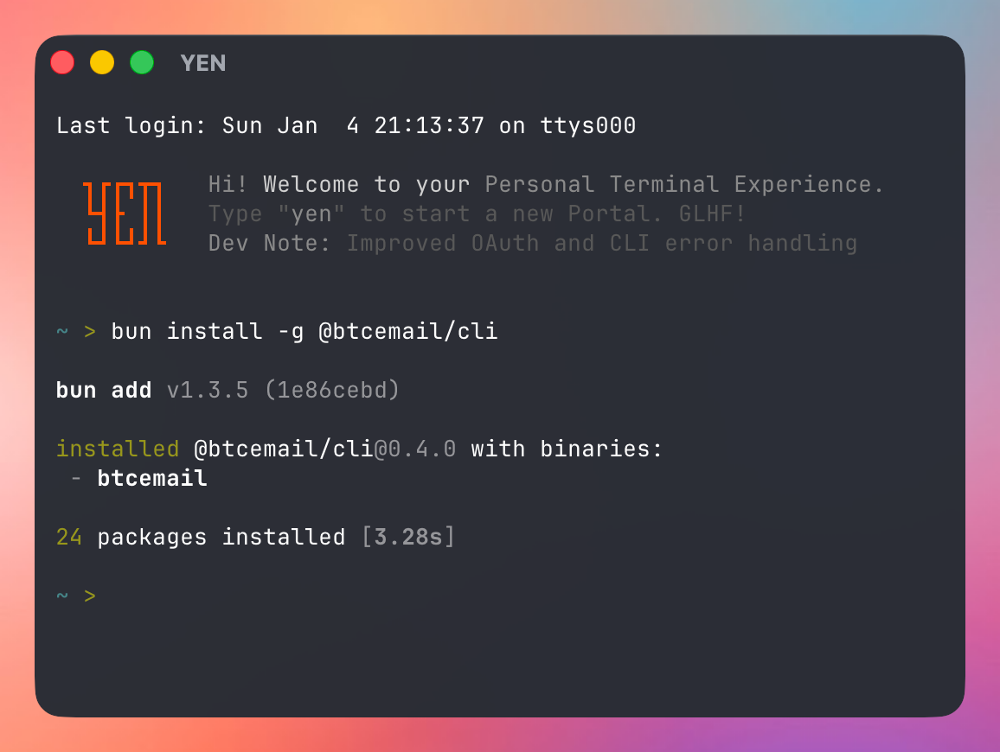

<p align="center">
  
</p>

<h1 align="center">Moving Paper</h1>

<p align="center">
  A moving (wall)paper for your desktop.
</p>

<p align="center">
  <!-- version-badge -->v0.008<!-- /version-badge --> · macOS 15+ · Swift 6 · MIT
</p>

---

## The Story

I just wanted a simple way to animate my wallpaper while I code. No bloated app, no subscription, no electron wrapper; just a fully native macOS menu bar utility that plays a video or GIF behind my desktop windows. That's it. That's the whole project. Magic.

The name is literal: It's your wallpaper, but it moves. Moving (Wall) Paper. **Moving Paper**.

---

## Download

<!-- download-link -->
[**Download Moving Paper v0.008**](https://github.com/8bittts/moving-paper/releases/download/v0.008/MovingPaper-0.008.dmg)
<!-- /download-link -->

Open the `.dmg`, drag **Moving Paper** to Applications, launch it. Look for the night sky icon in your menu bar -- that's it.

> Code-signed with Developer ID and notarized by Apple. Auto-updates via Sparkle (EdDSA-signed appcast).

---

## What It Does

Plays a looping video or GIF as your desktop background. Icons, right-click menus, drag-and-drop all work normally -- the animation sits underneath.

| Format | Extensions | Notes |
|--------|-----------|-------|
| Video  | `.mp4`, `.mov`, `.m4v` | Seamless looping, HEVC with alpha |
| GIF    | `.gif` | Native frame timing |

## Features

- **Per-desktop wallpapers** -- different wallpaper on each macOS Space and monitor, like native macOS
- **Sound control** -- mute or unmute video audio (muted by default)
- **Multi-monitor** -- auto-detects displays, rebuilds on hot-plug
- **Power-aware** -- pauses on Low Power Mode and thermal throttling
- **Auto-updates** -- checks hourly via Sparkle, EdDSA-verified
- **Menu bar only** -- no Dock icon, no clutter

## Menu

| Item | |
|------|---|
| **Choose File...** | Pick a `.gif`, `.mp4`, `.mov`, or `.m4v` |
| **Sound: Off / On** | Toggle video audio |
| **Wallpaper Mode** | All Desktops or Per Desktop |
| **Pause / Resume** | Stop or restart playback |
| **Remove Wallpaper** | Clear wallpaper |
| **Check for Updates...** | Sparkle update check |
| **Quit Moving Paper** | Exit |

In **Per Desktop** mode, each Space and monitor gets its own wallpaper -- switch Spaces and the wallpaper changes with it.

---

## Build from Source

Requires macOS 15.0+ and Swift 6.0+.

```bash
git clone https://github.com/8bittts/moving-paper.git
cd moving-paper
swift build
swift run MovingPaper
```

```bash
swift test                         # 20 tests
./scripts/build-dmg.sh             # build + sign + DMG + notarize + appcast
./scripts/build-dmg.sh --local     # sign + DMG, skip notarization
./scripts/build-dmg.sh --unsigned  # ad-hoc sign, no Developer ID
```

Version auto-increments on each release build (`0.001` -> `0.002` -> ...). The build script generates an EdDSA-signed `appcast.xml` for Sparkle auto-updates.

---

## How It Works

A borderless `NSPanel` at `desktopWindow + 1` sits above the system wallpaper but below Finder icons. `ignoresMouseEvents = true` keeps the desktop interactive. Video loops via `AVQueuePlayer` + `AVPlayerLooper`. GIFs animate via `CGAnimateImageAtURLWithBlock`. Space changes are tracked via `CGSGetActiveSpace` + `activeSpaceDidChangeNotification` to swap per-desktop wallpapers.

## Tech Stack

| | |
|---|---|
| Build | Swift Package Manager |
| Windowing | AppKit (`NSPanel`, `NSStatusItem`) |
| UI | SwiftUI via `NSHostingView` |
| Video | AVFoundation (`AVQueuePlayer`, `AVPlayerLooper`) |
| GIF | ImageIO (`CGAnimateImageAtURLWithBlock`) |
| Desktop tracking | CoreGraphics (`CGSGetActiveSpace`) |
| Updates | [Sparkle](https://sparkle-project.org) (EdDSA-signed appcast, vendored) |
| Signing | Developer ID + Apple notarization |

## Contributing

Fork, branch, `swift test`, PR. One feature or fix per PR.

## License

[MIT](LICENSE)

---

<p align="center">
  
</p>

<h3 align="center">Built with YEN</h3>

<p align="center">
  <a href="https://yen.chat">YEN</a> is a personal terminal experience that makes command-line work beautiful.<br/>
  Fast, customizable, and designed for developers who live in the terminal.<br/>
  <br/>
  <a href="https://yen.chat"></a>
</p>
